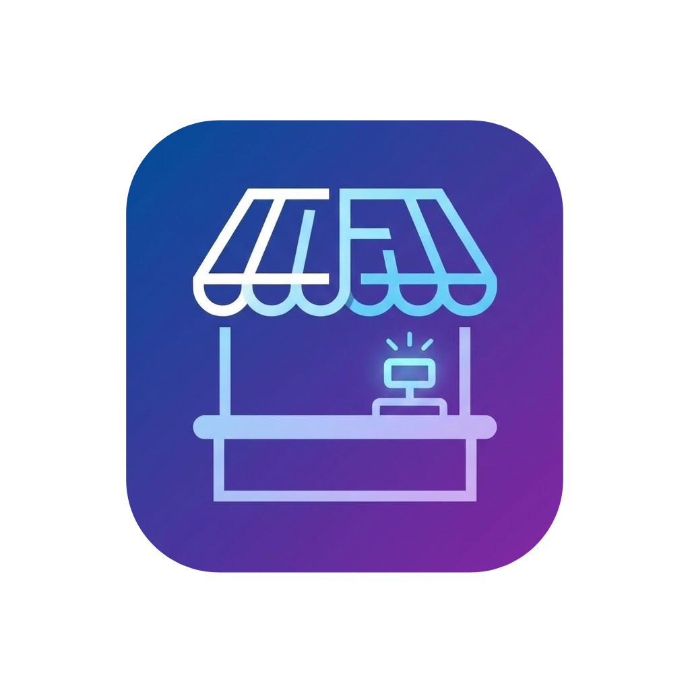

<p align="center">
  
</p>

<h1 align="center">Caja Feria · Punto de Venta para ferias y eventos</h1>

<p align="center">
  <b>Vende rápido. Controla stock. Cierra caja sin dolores de cabeza.</b>
</p>

<p align="center">
  
  
  
  
</p>

---

## 🎯 ¿Qué es Caja Feria?

**Caja Feria** es una aplicación de punto de venta (POS) creada para ferias y eventos de temporada, donde todo pasa rápido y el stock es limitado:

- Ferias navideñas y de decoración.
- Emprendedores con puestos por días o semanas.
- Ferias municipales, kermesses y ventas solidarias.

Está pensada para contextos donde:

- El tiempo de atención es clave ⏱️  
- El inventario se agota rápido 📦  
- Necesitas un cierre de caja claro al final de la jornada ✅  

---

## 💎 ¿Por qué Caja Feria?

- **Simple de usar**: cualquier persona puede aprenderla en minutos, sin curva de aprendizaje rara.
- **Diseñada para ferias**: soporta pedidos en paralelo, pagos pendientes y stock acotado.
- **Visual y minimalista**: interfaz limpia, tema navideño y foco en el flujo de ventas.
- **Tecnología moderna**: React + Vite + Supabase + Tailwind, fácil de mantener y extender.

---

## ✨ Funcionalidades actuales

### 🧾 Ventas rápidas

- Interfaz con **tarjetas de producto**, categorías y buscador.
- Filtros por tipo de producto (esferas, decoración, luces, etc.) para encontrar todo en segundos.
- Banner de **“Pedido en curso”** adaptado para mobile/tablet.

### 🧺 Pedidos en paralelo

- Permite llevar **varios pedidos abiertos** al mismo tiempo (Pedido 1, Pedido 2, …).
- Ideal cuando un cliente sigue eligiendo mientras otro ya quiere pagar.

### 💳 Pagos y ventas pendientes

- Formas de pago: **efectivo**, **transferencia** y **pendiente**  
  (pago con tarjeta puede activarse o desactivarse según el requerimiento).
- Vista dedicada de **Pendientes**:
  - Filtro por fecha.
  - Cobro directo desde la tabla.
  - Nota editable para registrar detalles del cliente o del pago.
  - La tabla siempre muestra solo ventas que realmente están pendientes.

### 🧮 Ventas manuales y edición avanzada

- **Ventas manuales**:
  - Permite agregar ítems sin stock (por ejemplo, servicios o productos no inventariados).
  - Al eliminarlos **no** se ajusta el inventario.
- **Edición de ventas**:
  - Modal para cambiar cantidades.
  - Cambio de método de pago.
  - Edición de notas.
  - Agregar o quitar productos.
  - Eliminar una venta (devuelve el stock de los productos reales).

### 📦 Stock en vivo

- El stock se actualiza automáticamente al:
  - Registrar una venta.
  - Editar una venta.
  - Eliminar una venta.
- La grilla de productos se recarga sin necesidad de refrescar la página.

### ✅ Cierre de caja

- Módulo de **cierre diario** con:
  - Conteo de efectivo y transferencias.
  - Cálculo automático de diferencias.
- Exportación de los datos a **CSV/PDF** para respaldo o reporte.

### 📱 UI pensada para terreno

- Tema navideño y diseño minimalista.
- **Blur opcional del total diario** para esconder montos frente a clientes.
- Botones reducidos a lo esencial en mobile/tablet.
- Botón de **cerrar sesión** siempre visible.

---

## 🧱 Estructura del proyecto

```txt
POS-demo/
├─ public/          # assets públicos (íconos, logo, manifest, favicon)
├─ src/
│  ├─ components/   # componentes reutilizables de UI
│  ├─ pages/        # vistas principales (Ventas, Pendientes, Cierre, etc.)
│  └─ lib/          # cliente Supabase, hooks, utilidades
├─ index.html
├─ package.json
└─ tailwind.config.mjs
